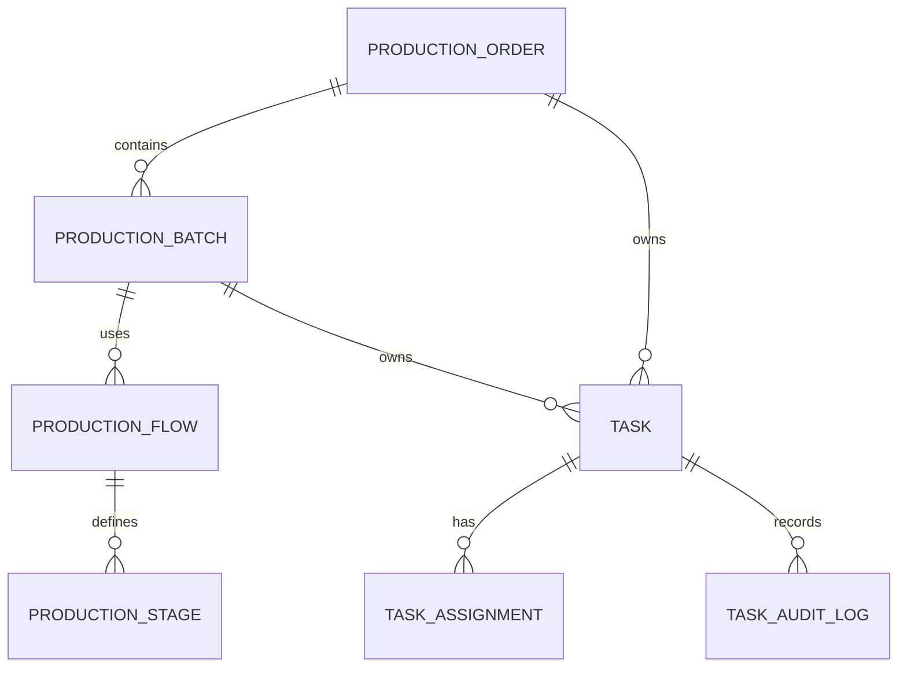

# ORCA Production Flow Architecture (ERP Consultant Review)

## 1. Target operating model

ORCA should be centered on material flow and production flow, not manual task percentages.

Order -> Batch -> Production Stage -> Material Flow -> Deliverable Task

## 2. Domain model

- ProductionOrder
  - orderCode, title, customerName, outputTarget, unit, status, deadline
- ProductionBatch
  - batchCode, name, plannedQuantity, actualQuantity, unit, status
- ProductionStage
  - stageCode, name, sequence, unlockRule, targetQuantity, inputQuantity, processedQuantity
- ProductionFlow
  - batchId, stageSequence, dependencyRule, expectedOutput
- Task
  - deliverable-oriented task title, primary worker, backup worker, supervisor
  - actual quantity only, no manual progress slider

## 3. Database schema

Key tables:

- production_orders
- production_batches
- production_stages
- production_flows
- production_stage_quantities
- tasks
- task_assignments
- task_audit_logs

## 4. ERD

## 5. Production Flow Engine

Recommended stage sequence:
1. Prepare materials
2. Roast
3. Cool
4. QC
5. Pack

Unlock rule is quantity based:
- Cooling may start when Roast.processedQuantity >= 20kg
- QC may start when Cooling.processedQuantity >= 20kg
- Packing may start when QC.processedQuantity >= 10kg

## 6. Quantity tracking system

Each stage must track:
- targetQuantity
- inputQuantity
- processedQuantity
- defectQuantity
- packedQuantity

Progress is derived from real measured quantity:

Progress = ProcessedQuantity / TargetQuantity * 100

## 7. Progress calculation logic

- If targetQuantity > 0, progress = actualQuantity / targetQuantity
- Clamp to 0..100
- Do not allow manual percentage editing in the UI

## 8. Task assignment logic

Tasks are deliverables, not SOPs.
Examples:
- Deliverable: Roast 120kg Arabica
- Deliverable: QC Batch BR-001
- Deliverable: Pack 480 bags

Roles:
- Primary Worker
- Backup Worker
- Supervisor

Permissions:
- Worker: accept / reject, update actual quantity, report issue
- Manager: reassign, override, approve completion
- No one: drag progress % manually

## 9. UI / UX guidance

- Replace manual sliders with quantity entry fields
- Show actual / target and auto-calculated progress
- Show stage status and material throughput instead of task-only completion bars

## 10. API design

Suggested endpoints:
- GET /api/production/orders
- POST /api/production/orders
- GET /api/production/batches/{batchId}/stages
- POST /api/production/stages/{stageId}/quantity
- POST /api/tasks/{taskId}/actual-output

## 11. Migration plan

1. Keep current order and batch entities as the backbone.
2. Introduce production_stage and production_flow tables.
3. Map existing task titles to deliverable tasks.
4. Derive progress from actual quantity rather than slider values.
5. Gradually retire manual progress editing in the UI.
